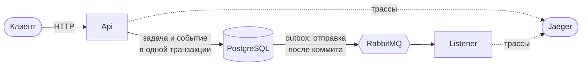
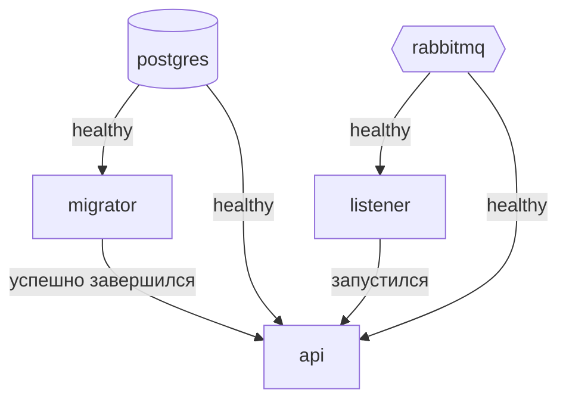
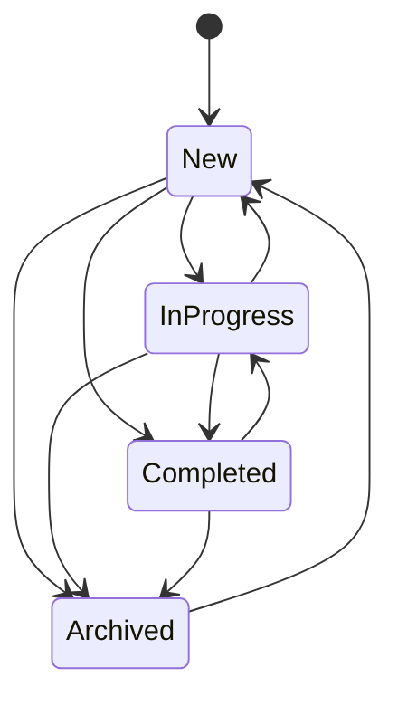

# FinBeat Task Management

Сервис управления задачами: CRUD по HTTP, каждое изменение публикуется как интеграционное событие,
отдельный слушатель их получает и логирует.

## Быстрый старт

```bash
docker compose up -d --build
```

| Что | Где |
|---|---|
| API | http://localhost:8080, Swagger на `/swagger` |
| RabbitMQ | http://localhost:15672, `guest` / `guest` |
| Jaeger | http://localhost:16686 |

Порты слушают только `127.0.0.1`. Чтобы открыть стенд наружу, поставьте `BIND_ADDRESS=0.0.0.0`
в `.env`, но помните: аутентификации нет, а `DELETE /tasks/{id}` удаляет по-настоящему.

Все порты и пароли уже заданы в `docker-compose.yml`, файл `.env` нужен только чтобы что-то
переопределить, чаще всего занятый порт. Образец лежит в `.env.example`.

```bash
docker compose logs -f api listener
docker compose down            # -v чтобы снести и данные
```

## Как это устроено



Событие и изменение задачи попадают в базу одной транзакцией (transactional outbox), поэтому не
бывает ни задачи без события, ни события без задачи. Отправка в брокер идёт уже после коммита и
повторяется сама, так что API поднимается даже при выключенном RabbitMQ.

`Listener` - отдельный деплой. Общего у него с API только контракты событий, никакой общей базы.

### Слои

```
src/
  Domain           агрегат и правила. Без зависимостей.
  Contracts        формат событий. Без зависимостей.
  Application      сценарии на Result<T>. Только EF Core.
  Infrastructure   PostgreSQL, MassTransit, outbox.
  Api              minimal API, валидация, Swagger.
  Listener         потребители событий. Только Contracts.
sql/               Задание 2, табличная функция.
tests/             архитектурные, модульные, интеграционные тесты.
```

Зависимости направлены внутрь, и это проверяется тестами, а не держится на соглашении.

### Порядок запуска в compose



Миграции накатывает отдельный контейнер `migrator`, который отрабатывает и выходит. Ни один хост не
мигрирует базу при старте: иначе два инстанса гонялись бы друг с другом, и каждому нужны были бы
права на DDL в рантайме.

`listener` стартует раньше API, потому что очереди объявляет именно он. Это фора, а не гарантия:
`service_started` означает лишь, что процесс существует. Всё, что успеет уйти в этот промежуток,
попадёт в очередь `unroutable`, а не пропадёт.

## API

| Метод | Путь | Ответы |
|---|---|---|
| `POST` | `/tasks` | 201 и заголовок `Location` |
| `GET` | `/tasks?status=&page=&pageSize=` | 200, страница, старые сверху |
| `GET` | `/tasks/{id}` | 200 / 404 |
| `PUT` | `/tasks/{id}` | 200 / 400 / 404 |
| `PUT` | `/tasks/{id}/status` | 200 / 400 / 404 / 409 |
| `DELETE` | `/tasks/{id}` | 204 / 404 |

Статусы ходят числами: `1` New, `2` InProgress, `3` Completed, `4` Archived. Что означает каждое
число, написано в OpenAPI: описание собирается из XML-комментариев самого перечисления, поэтому
разойтись они не могут. В событиях статус передаётся, наоборот, именем: потребителей не
передеплоивают вместе с API, а имя переживёт перенумерацию, о которой они не узнают.

Ошибки возвращаются как problem details (RFC 9457) со стабильным полем `code`, у ошибок валидации
дополнительно есть `errors` по полям.

### Переходы статусов



Всё, чего нет на схеме, даёт 409. Из архива задача возвращается в `New`, а не в прежний статус:
чтобы помнить прежний, понадобилось бы поле, которого задание не требует, а история и так есть
в событиях.

## Запуск из исходников

Нужен .NET SDK 8.0.4xx, он зафиксирован в `global.json`.

```bash
docker run -d --name finbeat-postgres -e POSTGRES_PASSWORD=postgres \
  -e POSTGRES_DB=finbeat_taskmanagement -p 5432:5432 postgres:16-alpine
docker run -d --name finbeat-rabbitmq -p 5672:5672 -p 15672:15672 rabbitmq:3-management-alpine
docker run -d --name finbeat-jaeger -p 16686:16686 -p 4317:4317 -p 4318:4318 jaegertracing/jaeger:2.21.0

dotnet tool restore
ConnectionStrings__TaskManagement="Host=localhost;Port=5432;Database=finbeat_taskmanagement;Username=postgres;Password=postgres" \
dotnet ef database update --project src/FinBeat.TaskManagement.Infrastructure \
  --startup-project src/FinBeat.TaskManagement.Infrastructure --context ApplicationDbContext

dotnet run --project src/FinBeat.TaskManagement.Listener   # сначала слушатель
dotnet run --project src/FinBeat.TaskManagement.Api        # затем API
```

`appsettings.Development.json` уже указывает на эти контейнеры, переменные окружения не нужны.

## Настройки

Любую настройку можно передать переменной окружения, вложенность через `__`.

| Настройка | Переменная | По умолчанию |
|---|---|---|
| `ConnectionStrings:TaskManagement` | `ConnectionStrings__TaskManagement` | нет, без неё старт падает |
| `RabbitMq:Host` / `Port` / `VHost` | `RabbitMq__Host` и далее | `localhost` / `5672` / `/` |
| `RabbitMq:User` / `Pass` | `RabbitMq__User` / `RabbitMq__Pass` | `guest` / `guest` |
| `OpenTelemetry:OtlpEndpoint` | `OTEL_EXPORTER_OTLP_ENDPOINT` | в Development указывает на Jaeger, иначе пусто и трассы не отправляются |

Строка подключения проверяется на старте, поэтому её отсутствие сразу называет ключ, а не всплывает
позже как NullReferenceException на первом запросе.

## Наблюдаемость

Оба хоста отправляют трассы по OTLP. Откройте http://localhost:16686, выберите
`FinBeat.TaskManagement.Api` и увидите запрос целиком, вместе с работой слушателя.

```
PUT /tasks/{id}/status        Api
  finbeat_taskmanagement      Npgsql, по спану на запрос
  outbox send                 публикация внутри транзакции
  outbox process              доставка в брокер после коммита
  TaskStatusChanged send
  task-status-changed receive Listener
  task-status-changed process
```

Контекст трассы переживает и outbox, и брокер, поэтому работа слушателя привязана к вызвавшему её
запросу, а не выглядит отдельной трассой.

### Очередь `unroutable`

У каждого обменника событий назначен alternate exchange. Если событие опубликовано, когда ни одна
очередь ещё не привязана, оно уходит в долговременную очередь `unroutable`, а не теряется.

```bash
curl -s -u guest:guest http://localhost:15672/api/queues/%2F/unroutable
```

Сообщения там означают, что события публиковались, когда никто не слушал. Очередь никто не разбирает
автоматически: это место, куда стоит заглянуть, а не механизм восстановления.

## Тесты

```bash
dotnet test -c Release                                       # всё
dotnet test -c Release --filter "Category!=RequiresDocker"   # без Docker
```

Тестам с Docker не нужен стенд выше: они поднимают свои контейнеры через Testcontainers.

## Задание 2

Табличная функция, которая по клиенту и интервалу дат отдаёт поденные суммы платежей, с нулями за
дни без платежей. Обе реализации и разбор решений: [`sql/README.md`](sql/README.md).

## Чего здесь нет

- **Владельца задачи.** В задании сказано «задачи пользователя», но аутентификации нет и поля
  `UserId` у агрегата тоже, так что все задачи видны всем. Добавить его значит сначала решить,
  откуда берётся личность пользователя.
- **Дедупликации на стороне потребителя.** Доставка гарантирует «хотя бы один раз», своей базы у
  слушателя нет, поэтому повторная доставка будет залогирована дважды.
